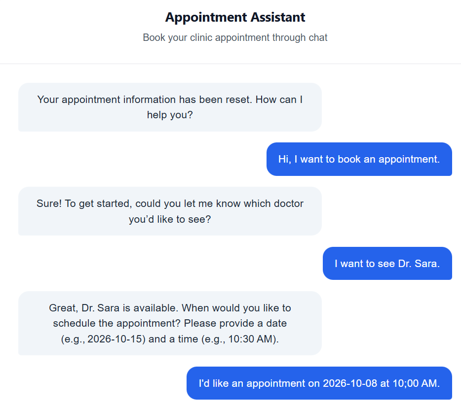
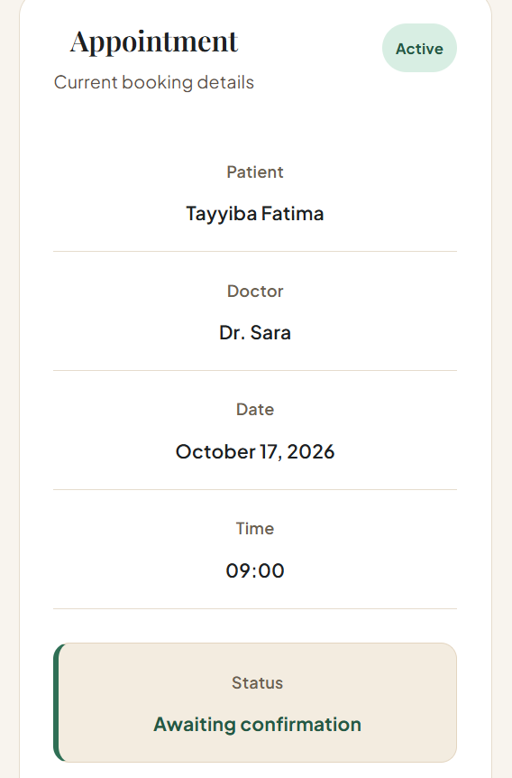
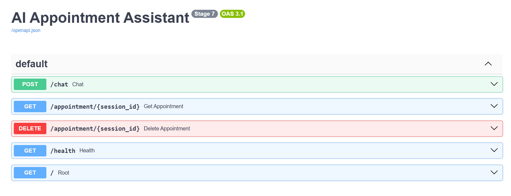

# AI Appointment Assistant

An AI-powered appointment booking system that uses **LLM tool calling, PostgreSQL, FastAPI, and React** to handle appointment conversations and perform real database-backed bookings.

The system allows users to interact naturally with an AI assistant to check doctors, find available appointment slots, confirm details, and book appointments.

## Overview

The AI Appointment Assistant demonstrates how an LLM can be connected to real application logic and a relational database instead of generating responses only.

The assistant can:

* Understand natural-language appointment requests
* Identify doctors and appointment requirements
* Check doctor information
* Check real appointment availability
* Ask for confirmation before booking
* Book appointments in PostgreSQL
* Maintain appointment state across messages
* Provide a React-based user interface
* Expose the backend through a FastAPI API

The current implementation uses **Groq with GPT-OSS-20B** for LLM-based tool calling.

---

## Screenshots

### AI Appointment Assistant — Main Interface



### Appointment Booking Conversation


### Successful Appointment Booking



### FastAPI Backend — Swagger UI



---

## Key Features

### AI-Powered Appointment Agent

The assistant uses an LLM with tool calling to decide when application functions should be executed.

The model can use tools for:

* Updating appointment information
* Checking doctors
* Checking appointment availability
* Booking appointments
* Resetting appointment state

The LLM does not directly modify the database. Database operations are handled by backend functions.

### PostgreSQL Database

Appointment information is stored in PostgreSQL rather than being hardcoded.

The backend checks:

* Available doctors
* Existing appointments
* Available time slots
* Appointment conflicts

A second availability check is performed immediately before booking to reduce the possibility of double booking.

### Session-Based State

Each user receives a session ID.

The application maintains appointment information associated with that session, including:

* Patient information
* Doctor
* Date
* Time
* Booking status

This allows the conversation to continue across multiple messages.

### Confirmation Before Booking

The assistant does not immediately create an appointment.

It first collects the required information, presents the appointment details to the user, and requires confirmation before performing the booking operation.

### React Frontend

The project includes a React-based frontend that provides:

* AI chat interface
* Appointment information panel
* Booking status
* Backend connection status
* Appointment reset functionality
* Loading and error states

### FastAPI Backend

The backend exposes REST API endpoints for communication between the frontend and the AI appointment system.

---

## Architecture

```text
                    User
                      │
                      ▼
              React Frontend
                      │
                      │ HTTP
                      ▼
              FastAPI Backend
                      │
          ┌───────────┴───────────┐
          │                       │
          ▼                       ▼
     Groq LLM                PostgreSQL
   GPT-OSS-20B                Database
          │
          ▼
     Tool Calling
          │
    ┌─────┼─────┬─────────────┐
    │     │     │             │
    ▼     ▼     ▼             ▼
 Doctor  Check  Book       Reset
 Check   Slots  Appointment  State
```

---

## AI Agent Workflow

```text
User Request
     │
     ▼
LLM analyzes the request
     │
     ▼
Determines required tool
     │
     ▼
Backend executes tool
     │
     ▼
PostgreSQL queried/updated
     │
     ▼
Tool result returned to LLM
     │
     ▼
LLM generates response
     │
     ▼
User receives result
```

For example:

```text
User:
"I want to book an appointment with Dr. Sara tomorrow at 9 AM."

        ↓

LLM identifies required information

        ↓

check_doctor()

        ↓

check_availability()

        ↓

Assistant presents appointment details

        ↓

User confirms

        ↓

book_appointment()

        ↓

PostgreSQL stores appointment

        ↓

Booking confirmation
```

---

## Technology Stack

### AI / LLM

* Groq API
* GPT-OSS-20B
* LLM Tool Calling
* Prompt Engineering
* Agentic AI concepts

### Backend

* Python
* FastAPI
* Pydantic
* Uvicorn
* psycopg2

### Database

* PostgreSQL
* SQL queries
* Database-backed appointment booking

### Frontend

* React
* Vite
* JavaScript
* CSS

### Development

* Git
* GitHub
* Python Virtual Environment
* Environment Variables

---

## Development Journey

The project was developed incrementally to demonstrate the evolution from a basic appointment application into an AI-powered backend system.

### Stage 1 — Basic Appointment System

* Basic appointment logic
* Initial application structure
* Doctor and appointment concepts

### Stage 2 — Structured Appointment Data

* Improved appointment handling
* Structured application state
* Database-oriented design

### Stage 3 — PostgreSQL Integration

* PostgreSQL database integration
* Persistent appointment storage
* Database queries for doctors and appointments

### Stage 4 — Groq + LLM Tool Calling

* Groq API integration
* GPT-OSS-20B
* LLM tool calling
* Natural-language appointment requests

### Stage 5 — FastAPI Backend

* FastAPI REST API
* Chat endpoint
* Appointment state endpoints
* Backend health endpoint

### Stage 6 — Improved Agent Logic

* Better tool selection
* Appointment state management
* Confirmation workflow
* Availability validation

### Stage 7 — Full AI Appointment Assistant

* Groq-powered AI agent
* PostgreSQL-backed booking
* Reliable application-managed state
* React frontend
* FastAPI backend
* Complete appointment workflow

---

## AI Engineering Concepts Demonstrated

This project focuses on practical AI engineering rather than simply connecting an LLM to a chat interface.

### LLM Tool Calling

The LLM can select backend tools based on the user's request.

### Agentic Workflow

The assistant can reason about what information is missing and determine which application function should be executed next.

### Grounded Responses

Doctor and appointment information comes from the application's database rather than being invented by the model.

### Application-Managed State

The backend maintains the authoritative appointment state. Generated LLM text is not treated as the source of truth.

### Database-Backed AI

The AI agent interacts with real PostgreSQL data through controlled backend functions.

### Reliability

The booking workflow checks availability before booking and performs another immediate availability check before the final database insertion.

### API-Based AI Architecture

The AI system is exposed through a FastAPI backend, allowing the frontend to communicate with the agent through HTTP endpoints.

---

## Example Conversation

```text
User:
I want to book an appointment.

Assistant:
Sure. Which doctor would you like to see?

User:
Dr. Sara.

Assistant:
What date would you like?

User:
September 20, 2026.

Assistant:
9:00 AM is available with Dr. Sara.
Would you like me to book it?

User:
Yes, please book it.

Assistant:
Your appointment has been successfully booked.
```

The actual available doctors and appointment slots are retrieved from PostgreSQL.

---

## Project Structure

```text
AI_Appointment_Assistant/
│
├── frontend/
│   ├── public/
│   ├── src/
│   ├── package.json
│   ├── package-lock.json
│   └── vite.config.js
│
├── Stage1/
├── Stage2/
├── Stage3/
├── Stage4/
├── Stage5/
├── Stage6/
├── Stage7/
│   └── main.py
│
├── screenshots/
│   ├── booking.png
│   ├── conversation.png
│   ├── conversation(2).png
│   └── swagger.png
│
├── .env.example
├── .gitignore
├── requirements.txt
└── README.md
```

---

## Running the Project

### 1. Clone the repository

```bash
git clone https://github.com/TayyibaFatima/AI-Appointment-Assistant.git
cd AI-Appointment-Assistant
```

### 2. Create a virtual environment

```bash
python -m venv venv
```

Windows PowerShell:

```powershell
.\venv\Scripts\Activate.ps1
```

### 3. Install backend dependencies

```bash
pip install -r requirements.txt
```

### 4. Configure environment variables

Create a `.env` file using `.env.example` and add:

```env
GROQ_API_KEY=your_groq_api_key

POSTGRES_HOST=localhost
POSTGRES_PORT=5432
POSTGRES_DB=your_database
POSTGRES_USER=your_username
POSTGRES_PASSWORD=your_password
```

### 5. Start the FastAPI backend

```bash
uvicorn Stage7.main:app --reload
```

The API will be available at:

```text
http://127.0.0.1:8000
```

Swagger documentation:

```text
http://127.0.0.1:8000/docs
```

### 6. Start the React frontend

Open another terminal:

```bash
cd frontend
npm install
npm run dev
```

The frontend will be available at:

```text
http://localhost:5173
```

---

## API Endpoints

| Method | Endpoint                    | Description                        |
| ------ | --------------------------- | ---------------------------------- |
| GET    | `/`                         | API information                    |
| GET    | `/health`                   | Backend health check               |
| POST   | `/chat`                     | Send a message to the AI assistant |
| GET    | `/appointment/{session_id}` | Retrieve appointment state         |
| DELETE | `/appointment/{session_id}` | Reset appointment state            |

---

## Security

* API keys are stored in environment variables.
* `.env` is excluded from Git using `.gitignore`.
* `.env.example` contains only placeholder values.
* Database credentials are not committed to the repository.
* The LLM cannot directly execute arbitrary database operations.
* Database operations are exposed through controlled backend tools.

---

## Real-World Applications

The architecture can be adapted for:

* Medical clinics
* Dental clinics
* Aesthetic clinics
* Salons
* Healthcare scheduling systems
* Customer service agents
* Business appointment systems

The same architecture can also be extended to messaging platforms such as WhatsApp.

---

## Future Improvements

Potential improvements include:

* WhatsApp integration
* Authentication and user accounts
* Redis-based session storage
* Cloud deployment
* Calendar integration
* Appointment cancellation and rescheduling
* Automated reminders
* Multi-clinic support
* Admin dashboard
* Persistent conversation history
* Improved evaluation and monitoring

---

## Project Status

**Completed — Stage 7**

The current version demonstrates a complete AI-powered appointment workflow using:

* Groq
* GPT-OSS-20B
* LLM Tool Calling
* PostgreSQL
* Session-Based State
* FastAPI
* React
* Real database-backed appointment booking

Repository:

https://github.com/TayyibaFatima/AI-Appointment-Assistant
