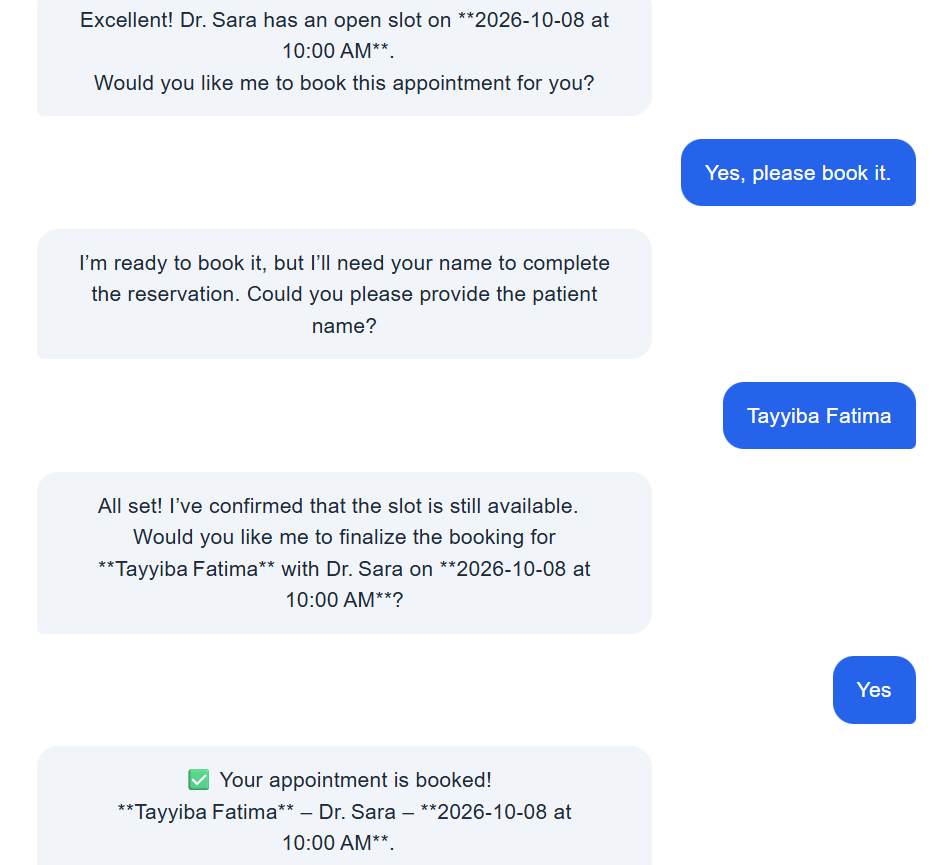

# AI Appointment Assistant

An AI-powered appointment booking assistant that uses **Groq LLM tool calling, PostgreSQL, FastAPI, and React** to handle appointment conversations, check doctor availability, and book appointments through natural language.

The project was developed progressively from a basic conversational assistant into a backend-connected AI agent with database integration, tool calling, session-based state, and a production-style web interface.

---

## Overview

The AI Appointment Assistant allows patients to interact with a conversational AI agent instead of using a traditional appointment form.

The assistant can:

* Understand natural-language appointment requests
* Identify doctors and available schedules
* Check real-time appointment availability
* Ask for missing appointment details
* Maintain conversation state
* Confirm appointment details before booking
* Book appointments directly into PostgreSQL
* Prevent double-booking through database checks
* Reset an appointment session
* Provide a React-based user interface
* Expose the backend through FastAPI REST APIs

The final system combines **LLM reasoning with deterministic backend tools**, allowing the AI to communicate naturally while relying on the database for actual appointment information.

---

## Screenshots

### AI Appointment Assistant — Main Interface


### Appointment Booking Conversation



### Successful Appointment Booking


### FastAPI Backend — Swagger UI


---

## Key Features

### 🤖 AI Conversational Agent

Uses **Groq's `openai/gpt-oss-20b` model** to understand user requests and manage appointment conversations.

### 🛠️ LLM Tool Calling

The AI agent can call backend tools for specific operations instead of generating appointment information itself.

Available tools include:

* `update_appointment`
* `check_doctor`
* `check_availability`
* `book_appointment`
* `reset_appointment`

### 🗄️ PostgreSQL Integration

Appointment information is stored and retrieved from PostgreSQL rather than being hardcoded.

The system checks the database before confirming available doctors, dates, and time slots.

### 🔒 Double-Booking Protection

Before creating an appointment, the backend performs an additional availability check and handles database conflicts to prevent duplicate bookings.

### 🧠 Session-Based State

Each conversation uses a session ID so the assistant can remember appointment information throughout the conversation.

### ⚡ FastAPI Backend

Provides REST endpoints for:

* Chat interactions
* Appointment retrieval
* Appointment deletion/reset
* Health checks

### 💻 React Frontend

A responsive interface allows users to have a complete appointment conversation with the AI agent.

---

## Architecture

```text
                    ┌─────────────────────┐
                    │      React UI       │
                    │     Frontend        │
                    └──────────┬──────────┘
                               │
                               │ HTTP
                               ▼
                    ┌─────────────────────┐
                    │      FastAPI        │
                    │      Backend        │
                    └──────────┬──────────┘
                               │
                               ▼
                    ┌─────────────────────┐
                    │    Groq LLM Agent   │
                    │    GPT-OSS-20B      │
                    └──────────┬──────────┘
                               │
                        Tool Calling
                               │
              ┌────────────────┼────────────────┐
              ▼                ▼                ▼
      Check Doctor      Check Availability   Book Appointment
              │                │                │
              └────────────────┼────────────────┘
                               ▼
                    ┌─────────────────────┐
                    │     PostgreSQL      │
                    │      Database       │
                    └─────────────────────┘
```

---

## AI Agent Workflow

A typical appointment conversation follows this process:

```text
User Request
     │
     ▼
Understand Intent
     │
     ▼
Collect Missing Information
     │
     ▼
Check Doctor
     │
     ▼
Check Availability
     │
     ▼
Present Appointment Summary
     │
     ▼
Ask for Confirmation
     │
     ▼
Book Appointment
     │
     ▼
Store in PostgreSQL
     │
     ▼
Return Confirmation
```

The LLM handles the conversational reasoning, while backend tools perform database-dependent operations.

This separation helps prevent the model from inventing doctors, schedules, or appointment availability.

---

## Technology Stack

### AI / LLM

* Python
* Groq API
* `openai/gpt-oss-20b`
* LLM Tool Calling
* Conversational AI
* Session-based state management

### Backend

* FastAPI
* Pydantic
* Uvicorn
* PostgreSQL
* Psycopg2
* Python-dotenv

### Frontend

* React
* Vite
* JavaScript
* CSS
* Browser Local Storage

### Development

* Git
* GitHub
* VS Code
* REST APIs
* Swagger / OpenAPI

---

## Development Journey

The project was developed through multiple stages.

### Stage 1 — Basic Conversational Assistant

Started with a basic appointment conversation system and established the core project structure.

### Stage 2 — Appointment State

Introduced structured appointment information and conversation state so the assistant could collect details such as:

* Patient name
* Doctor
* Date
* Time

### Stage 3 — PostgreSQL Booking

Connected the system to PostgreSQL and implemented appointment storage.

### Stage 4 — LLM Tool Calling

Introduced Groq-powered tool calling so the AI could interact with backend functions for appointment operations.

### Stage 5 — FastAPI Backend

Converted the system into a FastAPI backend with REST endpoints for chat and appointment management.

### Stage 6 — Improved Agent Workflow

Added doctor validation, availability checking, confirmation before booking, and safer appointment handling.

### Stage 7 — React Frontend

Built a complete React interface connected to the FastAPI backend, creating the final end-to-end appointment assistant.

---

## AI Engineering Concepts Demonstrated

This project demonstrates practical AI engineering concepts including:

* Large Language Models
* LLM tool calling
* Function calling
* Conversational state management
* Structured outputs
* Prompt engineering
* Backend integration with LLMs
* Database-connected AI agents
* Deterministic tool execution
* API development
* Session management
* Error handling
* Database validation
* Double-booking prevention
* React + AI backend integration

---

## Example Conversation

```text
User:
Hi, I want to book an appointment.

Assistant:
Sure! Which doctor would you like to see?

User:
I want to see Dr. Sara.

Assistant:
What date would you like the appointment?

User:
September 20, 2026.

Assistant:
What time would you prefer?

User:
9:00 AM.

Assistant:
I found an available appointment with Dr. Sara
on September 20, 2026 at 9:00 AM.

Would you like me to book it?

User:
Yes, please.

Assistant:
Your appointment has been successfully booked.
```

The actual available doctors and time slots are retrieved from PostgreSQL.

---

## Project Structure

```text
AI_Appointment_Assistant/
│
├── frontend/
│   ├── src/
│   │   ├── assets/
│   │   ├── App.jsx
│   │   ├── App.css
│   │   ├── index.css
│   │   └── main.jsx
│   ├── package.json
│   └── vite.config.js
│
├── Stage1/
├── Stage2/
├── Stage3/
├── Stage4/
├── Stage5/
├── Stage6/
├── Stage7/
│   └── main.py
│
├── screenshots/
│   ├── booking.png
│   ├── conversation.png
│   ├── conversation2.png
│   └── swagger.png
│
├── .env.example
├── .gitignore
├── README.md
└── requirements.txt
```

---

## Running the Project

### 1. Clone the repository

```bash
git clone https://github.com/TayyibaFatima/AI-Appointment-Assistant.git
cd AI-Appointment-Assistant
```

### 2. Create a virtual environment

```bash
python -m venv venv
```

### 3. Install backend dependencies

```bash
pip install -r requirements.txt
```

### 4. Configure environment variables

Create a `.env` file based on `.env.example`.

```env
GROQ_API_KEY=your_groq_api_key

POSTGRES_HOST=localhost
POSTGRES_PORT=5432
POSTGRES_DB=your_database
POSTGRES_USER=your_username
POSTGRES_PASSWORD=your_password
```

### 5. Start the FastAPI backend

```bash
python -m uvicorn Stage7.main:app --reload
```

The backend will run at:

```text
http://127.0.0.1:8000
```

### 6. Start the React frontend

Open another terminal:

```bash
cd frontend
npm install
npm run dev
```

The frontend will be available at:

```text
http://localhost:5173
```

---

## API Endpoints

| Method | Endpoint                    | Purpose                            |
| ------ | --------------------------- | ---------------------------------- |
| GET    | `/`                         | API information                    |
| GET    | `/health`                   | Backend health check               |
| POST   | `/chat`                     | Send a message to the AI assistant |
| GET    | `/appointment/{session_id}` | Retrieve appointment information   |
| DELETE | `/appointment/{session_id}` | Reset/delete appointment           |

Interactive API documentation is available through FastAPI Swagger UI:

```text
http://127.0.0.1:8000/docs
```

---

## Security

The project follows several basic security practices:

* API keys are stored in environment variables
* `.env` is excluded from Git
* Database credentials are not committed
* Backend validation is used before database operations
* Appointment booking requires explicit user confirmation
* Database availability is checked before booking

---

## Real-World Applications

The same architecture can be adapted for:

* Medical clinics
* Dental clinics
* Aesthetic clinics
* Hair and beauty salons
* Healthcare scheduling systems
* Service-based businesses
* Customer support agents
* Reservation systems

The doctors, appointment rules, database schema, and frontend can be customized according to the business requirements.

---

## Future Improvements

Potential future improvements include:

* Authentication and user accounts
* Admin dashboard
* Email/SMS appointment reminders
* WhatsApp integration
* Calendar integration
* Multi-clinic support
* Appointment cancellation and rescheduling
* Deployment with cloud infrastructure
* Persistent conversation history
* More advanced observability and evaluation
* Role-based access control

---

## Project Status

**Completed — Stage 7**

The current implementation includes:

* Groq LLM
* GPT-OSS-20B
* LLM Tool Calling
* PostgreSQL
* Session-Based State
* FastAPI Backend
* React Frontend
* Doctor Availability Checking
* Appointment Booking
* Confirmation Workflow
* Double-Booking Protection
* REST API
* Swagger Documentation

This project demonstrates an end-to-end **LLM-powered AI agent connected to real backend tools and a relational database**, rather than a simple chatbot or hardcoded demo.
